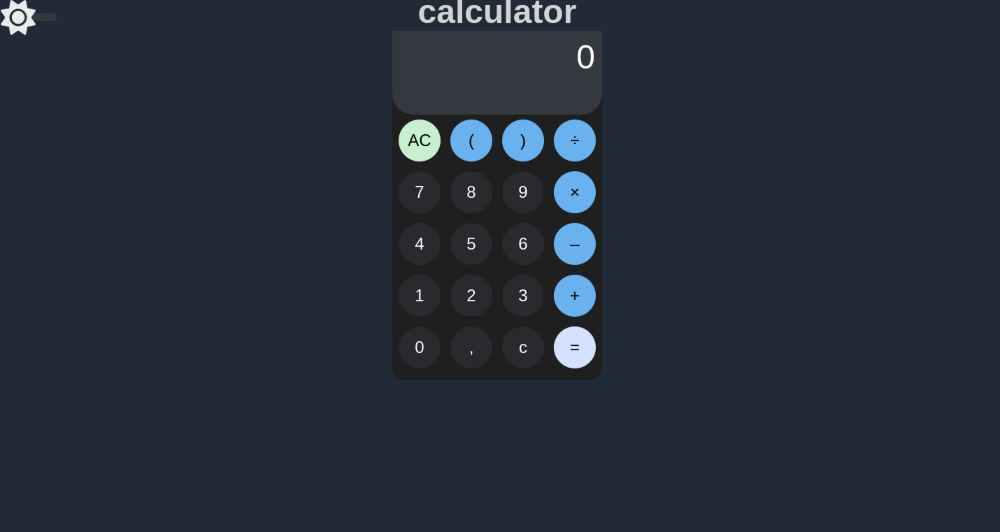
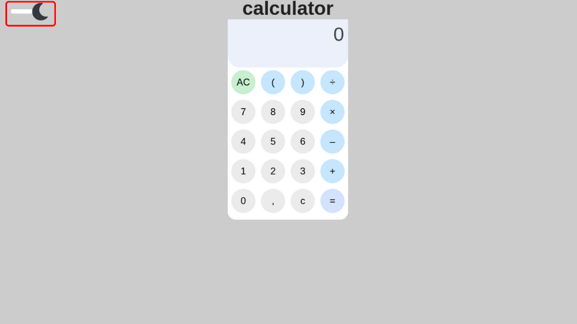

# calculadora feita com reactjs

essa calculadora feita com react foi inspirada na calculadora pradrão do android onde primeiro fiz um [projeto no figma](https://www.figma.com/file/XBbTjw9PQmPuAYyoaJTfDg/CALCULADORA?node-id=0%3A1)

assim como do android ela tem tanto dark quanto ligth mode

onde voce pode mudar usando o icone no canto superior esquerdo

para acessar a pagina do site [click aqui](https://dt59bt.csb.app/)
